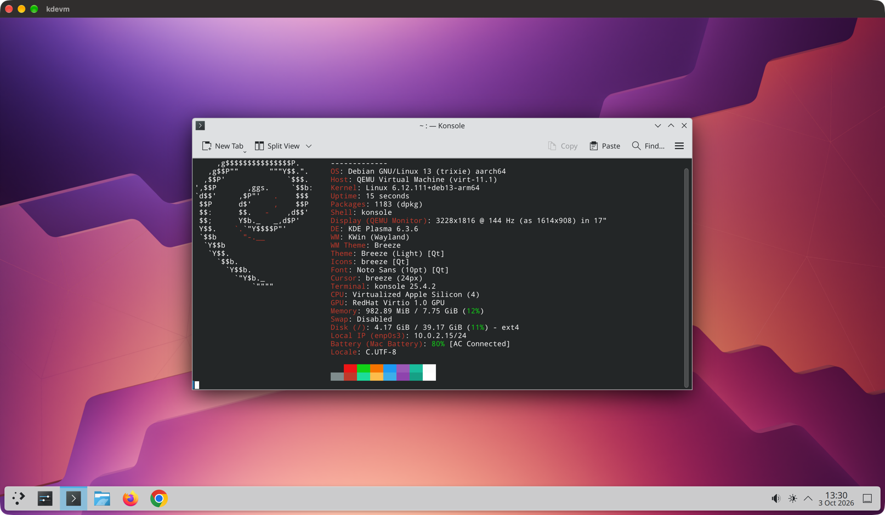

# kdevm

**A full Linux desktop, Debian 13 with KDE Plasma 6, in a window on your
Apple Silicon Mac, drawn by the Mac's own GPU.** One command builds it and
opens it. No RDP client, no login screen, no driver to install in Linux.



```
brew install qemu cdrtools pkgconf
git clone https://github.com/charles-hood/kdevm.git
cd kdevm
./kdevm.sh up
```

The first `up` takes about five minutes (it builds the VM software and the
Linux image). After that the desktop opens in about 15 seconds.

## What you get

- **A GPU-accelerated desktop.** Plasma on Wayland with full compositing.
  Chrome and Firefox are preinstalled, and Chrome runs with hardware
  compositing and WebGL.
- **A normal Mac window.** Drag to resize and the Linux desktop follows;
  it is sharp on a Retina display; full screen is one setting away.
- **Sound and microphone.**
- **Copy and paste in both directions**, text and images.
- **One shared folder**: `~/kdevm-share` on the Mac is `~/Mac` in Linux.
- **The Mac's time zone and battery level**, shown by Plasma as on any
  laptop.
- **ssh into the desktop**: `./kdevm.sh ssh`.
- **A disposable machine.** What you change survives `down` and `up`, and
  `./kdevm.sh rebuild` gives you a factory-fresh desktop in about two
  minutes. Keep anything that matters in the shared folder.
- **Light when idle**: about 7% of one core, and memory Linux is not using
  goes back to macOS (the measurements are under Numbers, below).

## Before you start

- An Apple Silicon Mac. kdevm has run on two machines: the M4 Pro on
  macOS 27 it was built on, and an M3 Pro on macOS 26, from a fresh clone
  by following this page. The VM software underneath supports macOS 15 and
  newer, but nobody has tried kdevm there yet;
  [reports are welcome](CONTRIBUTING.md).
- 16 GB of memory or more. Both Macs above have more (18 and 48 GB) and
  give the guest 8 GB. On a Mac with less than 16 GB the default drops to
  a 4 GB guest, but kdevm has never been run on such a Mac and nobody
  knows whether it works there at all. A 4 GB guest was tried on the
  48 GB Mac: the desktop and both browsers worked, but with heavy web
  graphics the VM's process took 7 to 8 GB of the Mac's memory, more than
  the guest's own 4 GB, which an 8 GB Mac does not have to give.
- Xcode or the Command Line Tools (`xcode-select --install`), for clang,
  Swift 6 and codesign.
- [Homebrew](https://brew.sh), in its usual place (`/opt/homebrew`), with
  three packages: `brew install qemu cdrtools pkgconf`. They supply
  `qemu-img`, the UEFI firmware files, `mkisofs` and `pkg-config`.
  Homebrew's own QEMU cannot draw with the GPU, so kdevm builds its own
  and uses Homebrew's only for those tools.
- An ssh key pair (`ssh-keygen -t ed25519` if you have none).
- About 1 GB of downloads on the first run and about 6 GB of disk.

Your login shell does not matter. The scripts run under the zsh that ships
with macOS (`/bin/zsh`) and ignore your shell startup files.

## The first run

```
./kdevm.sh up
```

`up` builds whatever is missing, then opens the window:

1. The VM software (a patched QEMU and a small helper), about two minutes.
2. The Linux image (a headless VM installs Plasma and both browsers into a
   Debian cloud image), two to three minutes.
3. The desktop. Plasma logs in by itself.

macOS may ask for two permissions, both for the VM's program, `kdevm`:

- **Microphone**, the first time something in Linux records.
- **Accessibility**, so that Command key shortcuts go to Linux (as the Meta
  key) while the window is focused. Without it they stay with macOS.

Your terminal may also be asked for Accessibility: `up` uses it once to
size the window. Everything works if you decline.

The Linux user has your Mac login name. Its password, should a lock screen
or a dialog ask, is in `~/.config/kdevm/password`.

If the window opens but the desktop looks wrong, run `./kdevm.sh preflight`
instead of `up`: it checks the graphics stack layer by layer over ssh,
prints a verdict that names the layer at fault, and then starts the
desktop. `./kdevm.sh status` is the first thing to run for any other
problem.

## Everyday use

```
kdevm.sh up          start the desktop (builds anything missing)
kdevm.sh down        clean power-off (your changes are kept; up resumes them)
kdevm.sh status      what is running, and the first diagnostic command
kdevm.sh state       the same in one JSON line, for dashboards
kdevm.sh ssh [cmd]   ssh <user>@localhost:2222
kdevm.sh rebuild     new factory image (fresh packages, fresh Chrome), new desktop
kdevm.sh destroy     drop your changes (--all: the factory and base image too)
```

Less often:

```
kdevm.sh preflight   up + graphics preflight over ssh, prints a verdict
kdevm.sh runtime     build/stage the QEMU runtime + helper (--force to rebuild)
kdevm.sh factory     build the Debian factory image
kdevm.sh launch      same as up
kdevm.sh console     tail the guest serial log
```

## Upgrading

Stop the VM first, with the version that started it: `./kdevm.sh down`, then
update the checkout. A VM left running across an update may not be
recognised by the new scripts; they will refuse to touch its disk, and it
then has to be powered off from inside the guest.

After an update, `./kdevm.sh up` rebuilds the runtime by itself when the
update needs a new one (about two minutes; macOS may ask for the microphone
again). The factory image is never rebuilt automatically: run
`./kdevm.sh rebuild` to get guest-side changes (it replaces the overlay).
[CHANGELOG.md](CHANGELOG.md) says which releases need which.

## Removing it

```
./kdevm.sh down
rm -rf ~/.cache/kdevm ~/.local/share/kdevm ~/.config/kdevm
```

Those three directories are everything kdevm writes: the images and logs,
the built VM software, and the generated password with your settings. If
you moved any of them with `KDEVM_STATE` or `KDEVM_RUNTIME_ROOT`, remove
those paths instead. What is left is yours to keep or delete: the shared
folder (`~/kdevm-share`), this checkout, and the three Homebrew packages.

## What it is not

- **Not remote.** The window exists on the Mac that runs the VM. For a
  desktop reachable over a network, an xrdp container does that job with
  near-zero idle cost; this project exists for the GPU.
- **No hardware video decode.** VA-API fails by design on this stack; video
  decodes on the CPU. Smooth 1080p is the bar, and it is met.
- **Not a sandbox.** Guest sudo is passwordless (documented as temporary;
  it bypasses PAM and would have to go for a Touch ID sudo integration).
  The guest reaches the network through user-mode slirp; only ssh is
  forwarded, to loopback.
- **Not an app bundle.** It is started from a terminal, and the runtime is
  ad-hoc signed, so a rebuilt runtime has a new identity and macOS re-asks
  the microphone permission.
- **Not a place to keep things.** The desktop is meant to be thrown away
  and rebuilt; see the shared folder.

## Configuration

Environment variables, optionally kept in `~/.config/kdevm/env` (sourced by
every script):

| variable | default | meaning |
|---|---|---|
| `KDEVM_CPUS` | 4 | vCPUs (try-omarchy's documented minimum) |
| `KDEVM_MEM_MB` | 8192; 4096 on a Mac with less than 16 GB | guest RAM; unused pages are returned to macOS |
| `KDEVM_SCALE` | auto | Plasma scale hint: auto = main display pixels / points, or 1, 2 |
| `KDEVM_WINDOW` | auto | first-window size: auto (display minus margins), keep, or `WxH` points |
| `KDEVM_FULLSCREEN` | off | open full screen |
| `KDEVM_ICON` | `assets/kdevm-icon.png` | the Dock icon: a square PNG (1024x1024 with transparency is ideal), converted on every `up` |
| `KDEVM_TIMEZONE` | mirror | mirror: the guest's time zone follows the Mac's, live (the Mac always wins); off: the guest keeps its own (UTC in a fresh factory) |
| `KDEVM_SHARE` | `~/kdevm-share` | the Mac folder shared with the guest, mounted at `~/Mac` there |
| `KDEVM_USER` | your login name | the guest user |
| `KDEVM_PASS_FILE` | `~/.config/kdevm/password` | the guest user's password (generated if missing) |
| `KDEVM_SSH_PUB` | first of `~/.ssh/id_{ed25519,ecdsa,rsa}.pub` | key installed in the guest |
| `KDEVM_RUNTIME_ROOT` | `~/.local/share/kdevm/runtime` | where built runtimes live, one per pin |
| `KDEVM_STATE` | `~/.cache/kdevm` | base image, factory, overlay, UEFI vars, sockets, logs |
| `KDEVM_DISK_GB` | 40 | sparse guest disk size |

## Numbers (M4 Pro, 4 vCPU, 8 GB, idle Plasma Wayland)

| | |
|---|---|
| Runtime build (QEMU + VirGL + libslirp + helper) | 96 s + 21 s |
| Factory image build (cloud-init, Plasma, both browsers, the battery module) | about 2 minutes (102 to 137 s over nine builds), 4.3 GB on disk |
| Boot to a logged-in desktop | 14 s |
| Clean power-off | 3 s |
| Idle QEMU CPU | about 7% of one core (5.4% median) |
| Charged memory at idle | 3.1 GB; a freed 2 GiB block in the guest came back to macOS within 25 s |
| Live resize | the guest mode follows the window through the virtio-gpu EDID, no helper needed |

Measured with try-omarchy's `profile-process.py`; method and provenance in
[docs/runbook.md](docs/runbook.md). The factory row is current. Every other
row was measured on 0.1.0, before the time zone and battery bridges and the
power applet were added, and has not been measured again. Chrome's own `chrome://gpu` page reports
native Wayland, hardware compositing, rasterization and WebGL on
`virgl (Apple M4 Pro)`, with no GPU-process crashes.

## Where things live

| | |
|---|---|
| the repo | `kdevm.sh`, `lib/kdevm-common.zsh` (kernel lock, process identity, QMP, config), `guest/factory.zsh` (the factory build as a function), the build scripts, the cloud-init template, vendored guest agents, `tests/checks.sh`, docs. Nothing large, nothing secret. |
| `$KDEVM_RUNTIME_ROOT/<pin>/` | built QEMU + helper, `provenance.txt`, `current` symlink. Slow to rebuild, keep it. Beside the pins: `TryOmarchy.icns`, the Dock icon `up` builds (the name is the one the runtime looks for). |
| `$KDEVM_STATE/` | base image, `factory.qcow2`, `work.qcow2`, `efivars.fd`, `run/` sockets, logs. Disposable. |
| `$KDEVM_SHARE/` | the one shared folder. An exchange folder, not a build tree. |

## How it works

The host runtime is [try-omarchy](https://github.com/omacom/try-omarchy)'s
patched QEMU 11.1.1 on Apple's Hypervisor.framework (23 patches: Cocoa
dynamic display, VirGL on native macOS OpenGL, HVF free-page memory
reclaim, HDA audio recovery, precise trackpad scroll and pinch, 9p
ownership mapping, and more), built by their own script from a pinned
commit, plus their Swift helper for the clipboard, time zone and battery
bridges. Everything Omarchy-, Arch- and Hyprland-specific is left behind.
The guest is an ordinary Debian cloud image provisioned once by cloud-init
into a factory image and run from a throwaway qcow2 overlay, so the VM
stays disposable: factory = image, overlay = container.

```
Mac window (Cocoa, gl=on)  <-- virglrenderer <-- virtio-gpu-gl-pci <-- Mesa virgl <-- KWin Wayland
Mac speakers / mic         <-- SDL audiodev  <-- intel-hda + hda-micro      <-- PipeWire
NSPasteboard               <-- omarchy-vm-helper --bridge-native-clipboard <-- virtserialport <-- clipboard agent (wl-clipboard)
Mac time zone              --> omarchy-vm-helper --bridge-native-timezone  --> virtserialport --> kdevm-timezone (timedatectl)
Mac battery (IOKit)        --> omarchy-vm-helper --bridge-native-battery   --> virtserialport --> battery agent --> kernel module (BAT0/ADP0) --> UPower --> Plasma
$KDEVM_SHARE               <-- virtio-9p (guest_owner patch)               <-- ~/Mac (systemd mount unit)
localhost:2222             <-- slirp hostfwd                                 <-- sshd
QMP unix socket            <-- down / status
fw_cfg opt/kdevm/*         <-- per-launch hints (scale)                     <-- /run/kdevm (boot service) -> first-login hook
```

- **Runtime.** `runtime/build.sh` clones try-omarchy at `runtime/pin.txt`,
  runs their `macos/build-qemu-gpu-runtime.sh` unchanged except for one
  string (the product name in the Cocoa identity patch becomes "kdevm"),
  builds the Swift helper with `swift build` (the same string changed on
  the one line that names the process its bridges will attach to), and
  stages both. QEMU is staged as `bin/kdevm`, as their app build stages it
  as "Try Omarchy": the Dock, Force Quit and crash reports label a bare
  executable with its file name. The result is ad-hoc signed with the
  hypervisor entitlement. `docs/patches.md` lists
  the 23 patches and what each does.
- **Guest.** `guest/factory.zsh` (run by `guest/build.sh` directly, or by
  `kdevm.sh factory`, `rebuild` and a first-run `up`, always in the process
  that holds the lifecycle lock) downloads and verifies the Debian 13 generic
  arm64 cloud image (the generic kernel has virtio-gpu, HDA, 9p; the cloud
  kernel does not), renders `guest/user-data.yaml.tmpl`, boots it headless
  with a NoCloud seed, waits for cloud-init, runs sixteen checks that fail
  the build (the kernel modules and options it needs, the Plasma Wayland
  session, the battery module, and the two policies that keep the guest
  from sleeping or acting on the battery), and powers off.
  The factory never runs cloud-init again. The guest files in
  `guest/vendor/` come verbatim from try-omarchy: the clipboard agent, its
  unit and udev rule, a PipeWire quantum drop-in for the emulated HDA, and
  the battery side (an agent, its unit and rules, and a small kernel module
  that DKMS builds in the factory, which presents the Mac's battery as
  `BAT0`/`ADP0` so UPower and Plasma's battery applet read it like any
  laptop's). The battery is shown, never acted on: sleep is disabled in the
  guest, because a suspended guest cannot be woken on this machine type,
  and neither Plasma's power manager nor UPower does anything at a critical
  level. The time
  zone receiver (`guest/files/kdevm-timezone`) is ours: their helper writes
  the Mac's zone to a virtio port every five seconds, udev starts the
  receiver when that port exists, and it calls `timedatectl` when the zone
  differs. A factory built before this feature has no receiver;
  `kdevm.sh rebuild` adds it.
- **Lifecycle.** `kdevm.sh up` makes a qcow2 overlay on the factory, copies
  the UEFI variable template to a private file, queries the helper for the
  host audio sample rates, launches QEMU under a private umask, waits for
  QMP, starts one helper per bridge beside it (clipboard, time zone,
  battery), each tracked by pid and start time as QEMU is, and sizes the
  window. Nothing restarts a helper that exits: `status` reports it and the
  next `down` and `up` bring it back. `down`
  asks the guest's systemd to power off over ssh (QMP's ACPI button does
  nothing useful under Plasma), QMP second, kill last.
- **Fail-closed.** One kernel advisory lock per state directory
  (`zsystem flock`, stock zsh), held for the command's lifetime and released
  by the OS however the command ends, crash and SIGKILL included. A command
  that finds it held exits: another command is running. A VM whose process
  cannot be inspected is reported as UNKNOWN and no verb will touch it until
  you resolve it.

## Roadmap

try-omarchy's helper already carries the host half of each of these, and on
the host one more bridge is now a few lines: a port and a name in the list
of bridges. The guest half is the real work and differs every time. The
battery side could be vendored verbatim, kernel module included; the time
zone receiver had to be written, because theirs is tied to Omarchy's menus.
Not started: audio device picker (choose the Mac output from Plasma's
applet), Mac camera (`v4l2loopback`), Touch ID for sudo (PAM, and the end of
passwordless sudo), USB passthrough, bridged networking. Upstream also
mirrors the Mac keyboard and language and recovers the guest clock after the
Mac sleeps; neither has been sized for kdevm. See the roadmap section of
[docs/plan.md](docs/plan.md).

## Documentation

- [docs/runbook.md](docs/runbook.md): provenance, every measurement, every
  gotcha met and how it was resolved, the fallback ladder and which rung
  held.
- [docs/plan.md](docs/plan.md): the plan this was built from, including the
  two external reviews it absorbed.
- [docs/patches.md](docs/patches.md): the 23 runtime patches.
- [CHANGELOG.md](CHANGELOG.md), [CONTRIBUTING.md](CONTRIBUTING.md),
  [THIRD_PARTY_NOTICES.md](THIRD_PARTY_NOTICES.md).

## Credits

The hard part of this project was done by the
[try-omarchy](https://github.com/omacom/try-omarchy) contributors (MIT): the
QEMU patch series, the VirGL-on-native-OpenGL work, the memory reclaim and
audio fixes, and the helper bridges. kdevm is the thin layer that points
that runtime at a Debian guest. Startergo's earlier
[homebrew-qemu-virgl](https://github.com/startergo) work is the ancestor of
the graphics patches.

## License

MIT (see [LICENSE](LICENSE)) for everything in this repository except one
vendored directory: `guest/vendor/try-omarchy-battery/`, try-omarchy's
battery kernel module, is GPL-2.0-only and carries its licence text. The
QEMU runtime kdevm builds is GPL-2.0 software and is not distributed here;
see [THIRD_PARTY_NOTICES.md](THIRD_PARTY_NOTICES.md).
